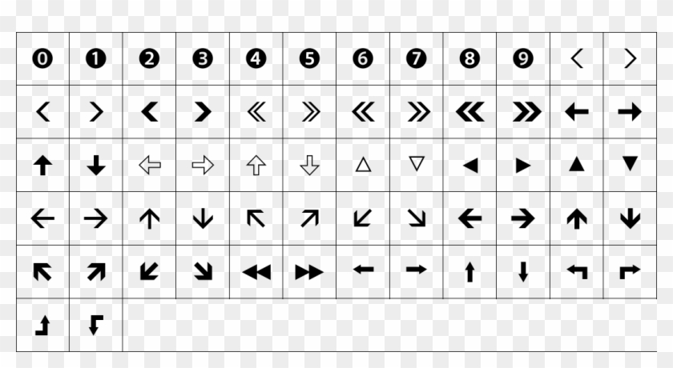

# Спецсимволы HTML/CSS

## Общие сведения

Списки спецсимволов можно посмотреть на ресурсах:

- [HTML Arrows](https://www.toptal.com/designers/htmlarrows/) - это исчерпывающий справочный веб-сайт для поиска кодов символов и сущностей HTML, символов ASCII и шестнадцатеричных значений Unicode для использования в веб-дизайне.
- [Спецсимволы HTML с русским описанием](https://unicode-table.com/ru/html-entities/)
- [Спецсимволы HTML - HTML5 Book](https://html5book.ru/specsimvoly-html/)
- [Числовые коды спецсимволов HTML](http://www.newart.ru/htm/myzavr/mz65.php)



## Вставка в тексте HTML

Чтобы вставить спецсимвол в текст HTML-документа, можно использовать его мнемонику — буквенный код. Мнемоника, как и HTML-код символа начинается со значка решётки `#` и заканчивается точкой с запятой `;`.

Например, знак копирайта © можно вставить в текст HTML-документа четырьмя способами:

- Просто скопировать сам символ: ©
- Вставить его десятичный HTML-код: `&#169;`
- Вставить его шестнадцатиричный HTML-код: `&#xa9;`
- Вставить его HTML-мнемонику: `&copy;`

## Вставка через CSS

Для вставки специальных символов через CSS код можно использовать только 16-ный код с заменой префикса `&#x` на `\` и отсеканием суффикса `;`.
Например, вместо `&#xa9;` необходимо `\a9`.

Спецсимволы добавляются при помощи свойства `content`, обычно для псевдоклассов `:before` или `:after`.

CSS

```css
.telephone:before {
  content: "\260E";
}
```

HTML

```html
<div class="telephone">0 800 20 27 27</div>
```

Результат

☎ 0 800 20 27 27
