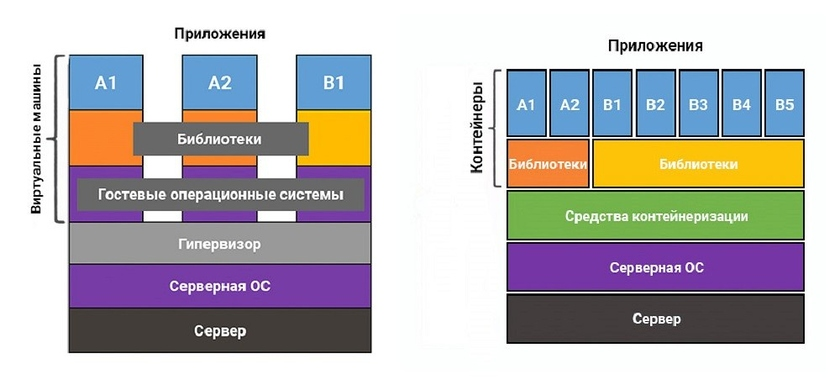

# Контейнерные приложения

## Общие сведения

Архитектура микрослужб является подходом к созданию серверного приложения в качестве набора малых служб и управлении ими с помощью контейнеров. Это означает, что архитектура микрослужб главным образом ориентирована на серверную часть несмотря на то, что этот подход также используется для внешнего интерфейса, где каждая служба выполняется в своем процессе и взаимодействует с остальными службами по таким протоколам, как HTTP/HTTPS, WebSockets или AMQP.

Программные контейнеры выступают в качестве стандартных модулей для развертывания программного обеспечения, которые могут содержать различный код и зависимости. Контейнеризация программного обеспечения позволяет разработчикам и ИТ-специалистам развертывать его в разных средах без каких-либо изменений или с минимальными изменениями.

Платформа модели программирования на основе микрослужб DAPR (Distributed Application Runtime) помогает разработчикам создавать устойчивые распределенные приложения, управляемые событиями. Будь то локально, в облаке или на периферийном устройстве. Dapr помогает решать проблемы, возникающие при создании микросервисов, и сохраняет независимость от платформы кода.

??? info "Почему следует использовать архитектуру микрослужб?"

    Если говорить кратко, то это гибкость в долгосрочной перспективе. Микрослужбы обеспечивают превосходные возможности сопровождения в крупных комплексных системах с высокой масштабируемостью за счет создания приложений, основанных на множестве независимо развертываемых служб с автономными жизненными циклами.

    Дополнительное преимущество в том, что микрослужбы можно масштабировать независимо. Вместо монолитного приложения, которое нужно масштабировать как единое целое, вы масштабируете отдельные микрослужбы. Тем самым можно масштабировать только функциональную область, требующую больше вычислительных или сетевых ресурсов, не затрагивая другие области приложения, которые на самом деле не нуждаются в масштабировании. Таким образом можно сократить расходы, так как требуется меньше оборудования.

    В подходе с использованием микрослужб функциональные возможности изолируются в небольших службах, и каждую службу можно масштабировать независимо от других. Подход на основе микрослужб нацелен на гибкость изменений и ускорение последовательных улучшений каждой микрослужбы, так как вы получаете возможность изменять небольшие части крупных, комплексных и масштабируемых приложений.

    Архитектура приложений на основе микрослужб позволяет применять принципы непрерывной интеграции и поставки. Она ускоряет доставку новых функций в приложение. Кроме того, разделение приложений на небольшие компоненты позволяет запускать и тестировать микрослужбы изолированно, а также развивать их независимо друг от друга, в то же время соблюдая строгие контракты их взаимодействия. Пока контракты или интерфейсы не нарушаются, можно изменять внутреннюю реализацию любой микрослужбы и добавлять новую функциональность, не мешая работе других микрослужб.

??? info "Что такое контейнеризация"

    Контейнеризация — это «облегченная» форма виртуализации на уровне операционной системы, которая позволяет запускать приложение и системные библиотеки в изолированной области, «контейнере», каждый из которых содержит все компоненты, необходимые для запуска приложения, не зависит от архитектуры серверной системы и взаимодействует с ОС при помощи стандартных интерфейсов. В этом программные контейнеры похожи на транспортные — неважно, что «внутри» контейнера, главное, чтобы он имел стандартные интерфейсы (в реальном мире — один из стандартных размеров).

    В чем разница между контейнерами и виртуальными машинами

    

## Ресурсы

- [Программирование Cloud Native. Микросервисы, Docker и Kubernetes](https://cloud-docs.infdev.com.ua/)
- [Микрослужбы .NET: Архитектура контейнерных приложений .NET](https://docs.microsoft.com/ru-ru/dotnet/architecture/microservices/)
- [Docker](../system-tools/docker.md)
- [Обзор контейнеров и Docker](https://docs.microsoft.com/ru-ru/dotnet/architecture/containerized-lifecycle/introduction-to-containers-and-docker)
- [dapr.io](https://dapr.io/)
- [Dapr для разработчиков .NET](https://docs.microsoft.com/ru-ru/dotnet/architecture/dapr-for-net-developers/)
