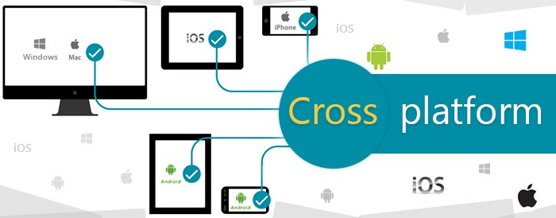

# .NET-платформа

## О платформах разработки

Платформа разработки приложений представляет собой полный набор всех необходимых и взаимосвязанных инструментов. Эти инструменты позволяют разрабатывать приложения, развертывать и тем самым обновлять их. Она имеет функциональные возможности для всех этапов разработки, таких как проектирование, кодирование, развертывание, интеграция, тестирование и т.д.

Существует достаточно много платформ разработки программного обеспечения, каждая из которых эффективна в каких-то областях применения. Большим плюсом для платформы является поддержка большого количества технологий и возможность их легкого объединения в одном проекте. При этом уже наработанный и использованный код в "боевых" условиях должен легко внедряться в новые проекты с минимальными доработками, а лучше вообще без них.

Также важна радужная перспектива развития плаформы разработки, поддерживаемая столпами программной индустрии и мировым сообществом программистов.

Несомненно для автора для широкого круга задач такой платформой является .NET 5.0+.

## О .NET и его будущем

[.NET](https://dotnet.microsoft.com/) - это универсальная платформа разработки с открытым исходным кодом, поддерживаемая Microsoft и сообществом .NET на GitHub. Он кроссплатформенный, начиная с .NET 5 это уже только один .NET и его можно использовать для работы с Windows, Linux, macOS, iOS, Android, tvOS, watchOS и WebAssembly.

Планируется выпускать основную версию .NET один раз в год, каждый ноябрь.

- [Политика поддержки .NET](https://dotnet.microsoft.com/platform/support/policy)

## Основные свойства ASP.NET Core 5.0+

### Кроссплатформенность

Разработка для `Windows`, `Linux`, `macOS`, `iOS`, `Android`, `tvOS`, `watchOS` и `WebAssembly`.

### Производительность при обработке запросов

.NET обладает хорошей производительностью при обработке запросов.

_Подробнее:_

[Рекомендации по повышению производительности ASP.NET Core](https://docs.microsoft.com/ru-ru/aspnet/core/performance/performance-best-practices)
[Лучшие практики для увеличения производительности ASP.NET Core приложений](https://bool.dev/blog/detail/luchshie-praktiki-dlya-uvelicheniya-proizvoditelnosti-aspnet-core-prilozheniy)
[Web Framework Benchmarks](https://www.techempower.com/benchmarks/)
[C# .NET против самых быстрых программ на Java](https://benchmarksgame-team.pages.debian.net/benchmarksgame/fastest/csharp.html)

### Модульность

Работа не с отдельными сборками, а с NuGet-пакетами, которые обладают множеством преимуществ, таких как высокая безопасность, улучшенная производительность, а также помогают снизить уровень обслуживания веб-приложений.

### Надежность и безопасность

Одним из основных направлений деятельности Microsoft является обеспечение безопасности. Если стало известно о какой-либо угрозе, немедленно следует обновление, чтобы повысить доверие и безопасность в системе.

### Обширная экосистема

С помощью сообщества и широкой сети поддержки могут быть решены различные технические запросы.

_Подробнее:_

- [.NET](https://dotnet.microsoft.com/)
- [NuGet](https://www.nuget.org/packages?q=asp.net+core)
- [GitHub](https://github.com/search?l=C%23&q=asp.net%2Bcore&type=Repositories)
- [Extensions for the Visual Studio family of products](https://marketplace.visualstudio.com/)
- [Visual Studio Magazine](https://visualstudiomagazine.com/Home.aspx)

### Глобализация и локализация

.Net помогает локализоваться на множество языков и культур.

### Самостоятельные приложения

Веб-приложения могут работать как в связке с распространенными веб-серверами, так и автономно со встроенным Kestrel.

### Открытый код

Открытый исходный код включает в себя библиотеки, языки, компиляторы, веб-среду ASP.NET, платформы рабочего стола Windows и, наконец, библиотеку доступа к данным ядра базовой структуры.

### Покрытие технологий

Разработка с использованием различных технологий (MVC, Razor Pages, Blazor, Web API) и возможность их простого и органичного совмещения в одном приложении. На клиенской стороне поддержка популярных фреймворков JavaScript, а также возможность использования языка C# с помощью технологии WebAssembly (Wasm).

### Минимальное кодирование

При минимальном количестве строк кодирования разработчик ASP.NET может достичь тех же результатов, что и при наличии многочисленных строк кодирования.

---

_Дополнительно_:

[Что выбрать новичку: C# или F#](https://skillbox.ru/media/code/chto_vybrat_novichku_c_ili_f/)
