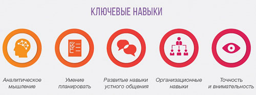

# О навыках

## Общие сведения

Процесс обучения – это процесс, направленный на усвоение обучаемым определенных ЗУНов (знаний, умений и навыков). Специалист в своей сфере деятельности должен Знать, Уметь, Владеть (навыком).

- [Знания, Умения, Навыки и Способности](https://www.dekanblog.ru/2020/05/gimnastika-uma/znaniya-umeniya-navyki-i-sposobnosti/)
- [ЗНАНИЯ, УМЕНИЯ, НАВЫКИ](http://trenerskaya.ru/article/view/znaniya-umeniya-navyki)

## Навык

На́вык — способность деятельности, сформированная путём повторения и доведения до автоматизма.

Выработка навыка — это процесс, который достигается путём выполнения упражнений (целенаправленных, специально организованных повторяющихся действий). Благодаря упражнениям способ действия совершенствуется и закрепляется. Показателями наличия навыка является то, что человек, начиная выполнять действие, не обдумывает заранее, как он будет его осуществлять, не выделяет из него отдельных частных операций. Благодаря формированию навыков действие выполняется быстро и точно, и можно сконцентрироваться на развитии и получении новых знаний, умений и навыков.

На формирование навыка влияют:

- мотивация, обучаемость, прогресс в усвоении, упражнения, подкрепление, формирование в целом или по частям
- для уяснения содержания операции — уровень личного развития, наличие знаний, умений, способ объяснения содержания операции, обратная связь
- для овладения операцией — полнота уяснения её содержания, постепенность перехода от одного уровня овладения к другому по определённым показателям (автоматизированность, [интериоризованность](https://ru.wikipedia.org/wiki/Интериоризация), скорость и пр.)

## Жесткие и мягкие навыки

**Жесткие навыки** - (англ. Hard skills) профессиональные навыки, которым можно научить и которые можно измерить. Для обучения hard skills необходимо усвоить знания и инструкции, качество обучения можно проверить с помощью экзамена. Примеры hard skills: набор текста на компьютере, вождение автомобиля, чтение, математика, знание иностранного языка, использование компьютерных программ.

**Мягкие навыки** - (англ. Soft skills) универсальные компетенции, которые гораздо труднее измерить количественными показателями. Иногда их называют личными качествами, потому что они зависят от характера человека и приобретаются с личным опытом. Примеры soft skills: такие социальные, интеллектуальные и волевые компетенции, как коммуникабельность, умение работать в команде, креативность, пунктуальность, уравновешенность.

Термины hard и soft skills берут начало в военном деле. В 1959 году армия США начала разрабатывать научно обоснованный подход к подготовке военнослужащих. В ходе разработки исследователи выявили важность для военнослужащих не только профессиональных навыков (hard skills), но универсальных компетенций (soft skills), которые не поддаются планомерному обучению. Понимание различий между soft и hard skills было выражено в доктрине "Системы проектирования военной подготовки" 1968 года таким образом: hard skills являются навыками работы преимущественно с машинами, soft skills - навыками работы с людьми и бумагами. После того, как термины прижились в военной науке и психологии, они перешли в свободное употребление в сфере бизнеса. Сегодня в вакансиях, в том числе на русском и украинском языках, можно встретить вместо разделов "профессиональные навыки" и "личные качества" - hard skills и soft skills.

## Дополнительные ресурсы

_Подробнее:_

- [Что такое навыки и как их определить?](https://wikigrowth.ru/razvitie/navyiki/)
- [Какие навыки ценятся больше всего в любых профессиях](https://hh.ru/article/24181)
- [Зачем инженеру soft skills](https://habr.com/ru/company/epam_systems/blog/418621/)
