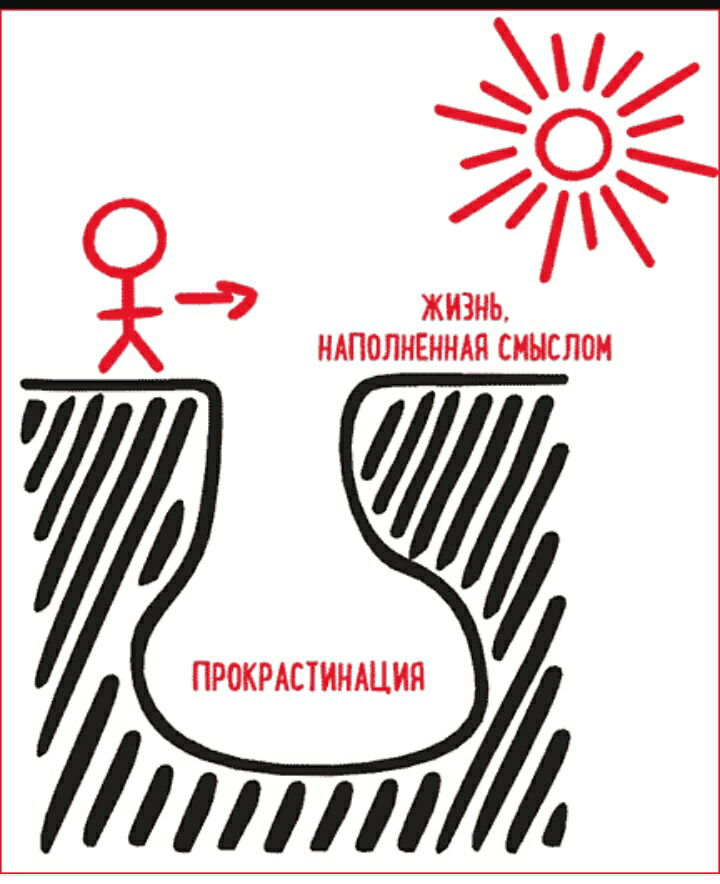

# Прокрастинация

Прокрастина́ция (от англ. procrastination «задержка, откладывание») — в психологии склонность к постоянному откладыванию даже важных и срочных дел, приводящая к жизненным проблемам и болезненным психологическим эффектам.

Можно выделить особенности откладывания дел, характерные для прокрастинации, что позволяет отделить этот феномен от других близких по содержанию явлений:

- сам факт откладывания;
- наличие планов — откладываются дела, которые были предварительно ограничены определёнными сроками;
- осознанность — человек не забывает про важную задачу и физически может ею заниматься, он откладывает её выполнение умышленно;
- иррациональность — субъекту очевидно, что откладывание вызовет те или иные проблемы, то есть он действует заведомо вопреки своим интересам;
- стресс — откладывание вызывает негативные эмоции и утомление.

Исходя из этого, можно отделить прокрастинацию от лени (лень не сопровождается стрессом), отдыха (при отдыхе человек восполняет запасы энергии, а при прокрастинации — теряет). Также прокрастинация не равнозначна неумелому планированию, когда планы не исполняются и сдвигаются потому, что основываются на неверных оценках возможностей и производительности, хотя ошибки в планировании могут провоцировать или усугублять прокрастинацию.

_Подробнее:_

- [Что такое прокрастинация и как с ней бороться](https://nebopro.ru/blog/prokrastinaciya/)

