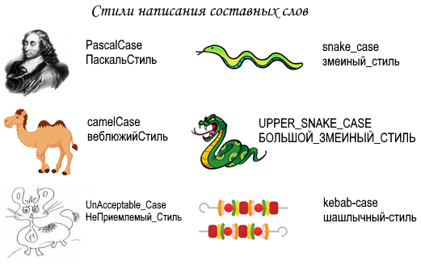

# Соглашения об именах

## Общие сведения

При написании программного кода, да и при работе за компьютером всегда приходиться давать имя чему-либо. При этом следует придерживаться:

- во-первых, ограничений по допустимому набору символов
- во-вторых, общепринятых и каким-то образом стандартизованным стилям наименований

> <small>Например, при присваивании имен файлам, есть ограничения в наборах символов, которые зависят от операционной системы (ОС), а также они могут быть чувствительными к регистру.</small>

При кодировании же на конкретном языке программирования определен свой набор допустимых символов, причем никак не зависящей от ОС, и чувствительность к регистру определена своя.

Стиль написания составных слов является одним самых важных соглашений о наименованиях в языках программирования, причем их может быть несколько в одном языке, но для разных целей.

## Стили написания составных слов

### Общие замечания

Даже среди самых распространенных стилей написания составных слов в разных источниках есть путаница.

> <small>Например, стиль `PascalCase` часто путают с `camelCase`, но это, тем не менее, отдельный стиль. Также встречается, что для `camelCase` вводят уточняющие стили, такие как `upperCamelCase` и `lowerCamelCase`.</small>

Сделана попытка убрать такие несоответствия, в том числе в самих названиях этих стилей, которые должны говорить сами за себя. Ниже описаны основные стили, очищенные от каких-либо модификаций.

### PascalCase

В стиле `PascalCase` все слова пишутся слитно между собой, при этом каждое слово внутри имени пишется с прописной буквы.

Примеры: `UserLoginCount`, `DefaultContentManager`

_Встречающиеся псевдонимы_ `CamelCase`, `upperCamelCase`, _по возможности, не используйте_.

### camelСase

В стиле `camelCase` («Верблюжий», «Горбатый») все слова пишутся слитно между собой и с прописной буквы начинаются все слова, кроме первого.

Примеры: `userLoginCount`, `defaultContentManager`

_Встречающиеся псевдонимы_ `lowerCamelCase`, _по возможности, не используйте_.

### snake_case

В стиле `snake_case` («Змеиный») все слова разделяются символом подчеркивания и пишутся строчными буквами.

Примеры: `user_login_count`, `default_content_manager`

### UPPER_SNAKE_CASE

В стиле `UPPER_SNAKE_CASE` («Змеиный в верхнем регистре») все слова разделяются символом подчеркивания и пишутся заглавными буквами.

Примеры: `USER_LOGIN_COUNT`, `DEFAULT_CONTENT_MANAGER`

### kebab-case

В стиле `kebab-case` («Шашлычный») все слова разделяются символом дефиса и пишутся строчными буквами.

Примеры: `user-login-count`, `default-content-manager`

## Соглашения в языках

В разделе кратко приводятся основные соглашения о наименованиях в распространенных языках програмирования.

### C# (Си-шарп)

- **PascalCase** : классы, методы, свойства, интерфейсные, структуры, перечисления (перед именем интерфейса добавляется символ **I**)
- **camelCase** : переменные, включая параметры методов
- **UPPER_SNAKE_CASE** : константы

Дополнительно:

- [.NET - Правила именования](https://docs.microsoft.com/ru-ru/dotnet/standard/design-guidelines/naming-guidelines)
- [.NET - Руководство по языку C#](https://docs.microsoft.com/ru-ru/dotnet/csharp/)

### F# (эф-шарп)

- **PascalCase** : типы, методы, свойства, поля, интерфейсные типы, теги объединения)
- **camelCase** : параметры, внутренние let-значения

Дополнительно:

[.NET - F#. Соглашения об именах](https://docs.microsoft.com/ru-ru/dotnet/fsharp/style-guide/component-design-guidelines#naming-conventions)
[.NET - Руководство по языку F#](https://docs.microsoft.com/ru-ru/dotnet/fsharp/)
[fsharp.org - Learning F#](https://fsharp.org/learn.html)

### C++

См. [Google C++ Style Guide](https://google.github.io/styleguide/cppguide.html)

### TypeScript

- **PascalCase** : имена типов, перечисляемые значения
- **camelCase** : имена функций, свойств и локальных переменных

Дополнительно:

- [Microsoft. Руководство по кодированию](https://github.com/microsoft/TypeScript/wiki/Coding-guidelines)
- [Angular. Руководство по стилю](https://angular.io/guide/styleguide#general-naming-guidelines)
- [typescriptlang.org - Документация](https://www.typescriptlang.org/docs/)

### JavaScript

- **PascalCase** : классы или конструкторы
- **camelCase** : функции, объекты или экземпляры

Дополнительно:

- [Руководство по написанию JavaScript-кода от Airbnb](https://github.com/leonidlebedev/javascript-airbnb)
- [w3schools.com - JavaScript учебник](https://www.w3schools.com/js/)
- [javascript.ru - Советы по стилю кода](https://learn.javascript.ru/coding-style)
- [MDN - Изучение веб-разработки. JavaScript](https://developer.mozilla.org/ru/docs/Learn/JavaScript)
- [Google JavaScript Style Guide](https://google.github.io/styleguide/jsguide.html)

### Python (Питон)

- **PascalCase** : классы
- **UPPER_SNAKE_CASE** : константы
- **snake_case** : все другие имена

Дополнительно:

- [PEP 8 -- Style Guide for Python Code](https://www.python.org/dev/peps/pep-0008/)
- [ПИТОНТЬЮТОР - Бесплатный курс](https://pythontutor.ru/)

> PEP (англ. Python Enhancement Proposal) — предложений по развитию Python
