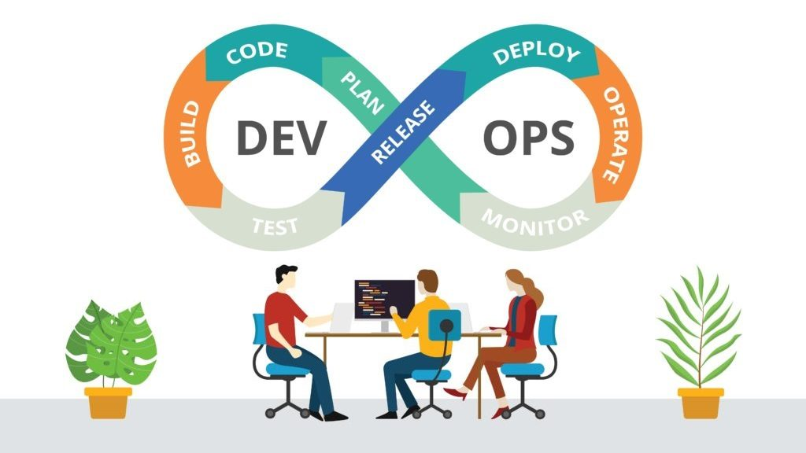

# Шпаргалка разработчика ПО

Здесь публикуется информация по общим вопросам, которые возникают в процессе взаимодействия автора с людьми, работающими с компьютером, и специалистами, с которыми его судьба и работа. Раскрываются некоторые понятия для однозначного понимания затрагиваемой сути обсуждаемых тем.

Отталкиваясь от уже опубликованных материалов сайта, можно не повторяться, а сконцентрировать внимание и уделить больше времени решению конкретных более специализированных вопросов.

!!! info "Навыки - без них никуда"

    Материалы раздела "[Навыки](skills/index.md)" могут быть полезны любому пользователю и специалисту с любой профессией.

    Имеешь навыки и хочешь большего - см. "[Як знайти роботу. Суперінструкція від Work.ua](https://www.work.ua/jobseeker/resources/)"

Также автор использует сайт как шпаргалку для себя, чтобы быстро обновлять/уточнять собственные знания и закреплять полученные новые знания и умения, в том числе путем подготовки к публикации новых материалов.

Материалы представлены в структурированном виде, в основном это краткие статьи со ссылками на ресурсы, где конкретная тема раскрывается более детально.

Буду рад, если материалы и отправные точки с сайта будут полезны еще кому-то. Особенно начинающим разработчикам легко "утонуть" в море информации, когда не знаешь с чего начинать и на что обращать внимание.

Автор в настоящее время специализируется в основном в области ASP.NET технологий, занимается как разработкой, так и сопровождением своих приложений и других авторов.

!!! info "Демонстрации"

    - [Классификаторы](https://classifiers-ui.infdev.com.ua/) - демо веб-приложения и веб-сервиса
    - [Исходники на Github](https://github.com/InfDev/CDPN.Classifiers)

Автор также занимается

- разработкой технической документации и ее публикацией на веб-ресурсах
- оперативной поддержкой в актуальном состоянии онлайн-материалов/журналов по сопровождению
- администрированием систем по мере необходимости и возможности
