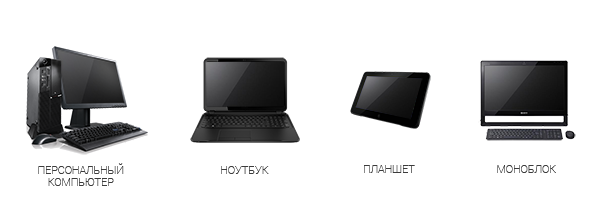
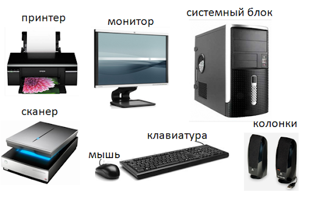
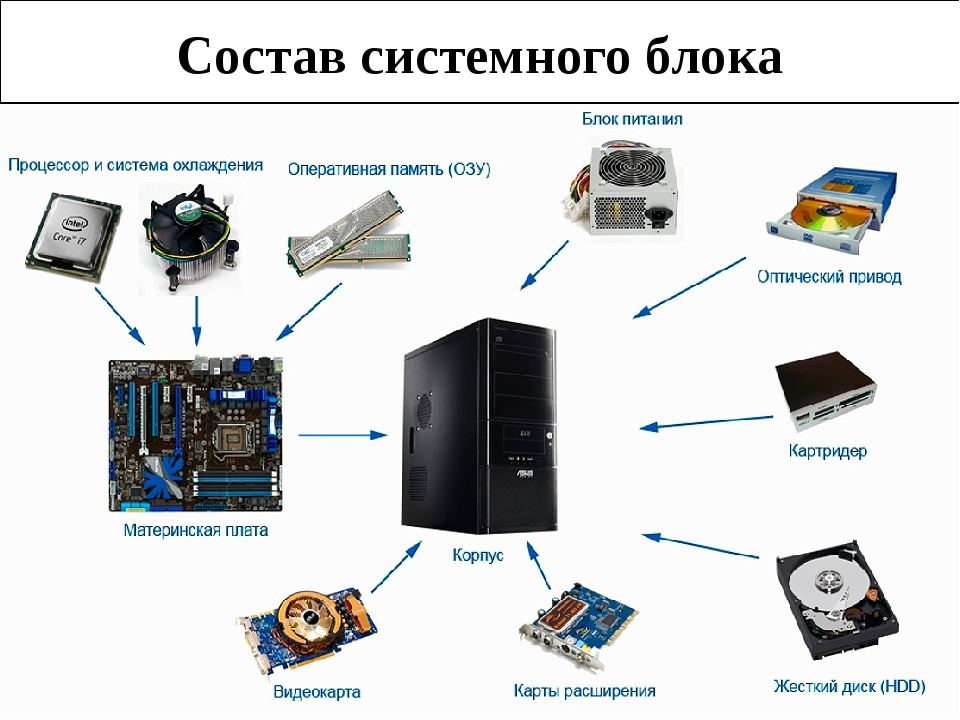

# О персональном компьютере

## Общие сведения

Персональный компьютер (ПК) используется для широкого круга задач как в быту, так и в бизнесе.
Для решаемых задач подбирается конфигурация компьютера, периферийные устройства и программное обеспечение (ПО). Для обмена информацией и получения различных сервисов компьютеры подключаюся к локальной сети и/или глобальной с выходом в Интернет.

Хотя часто в обиходе под ПК подразумевают настольный (десктопный) компьютер, но на самом деле ПК бывают разных видов.

К персональным компьютерам можно отнести и смартфоны - устройства объединяющее в себе функции персонального органайзера и мобильного телефона.

## Устройство ПК

Минимальная конфигурация ПК в обязательном порядке включает:

- системный блок
- устройство ввода (клавиатура, мышь, трекбол, сенсорный экран, ...)
- устройство вывода отображения (монитор, сенсорный экран, ...)

Для расширения фунций непосредственно к ПК или к сети, в которой подключен ПК, подключается дополнительное периферийное оборудование: колонки, камеры, принтеры, сканеры, хранилища, ...

Все аппаратные устройства и компьютерные комплектующие еще называют "железо" (англ. hardware).

## Устройство системного блока ПК

Настольный компьютер обладает тем преимуществом, что его компоненты в определенных пределах легче и дешевле модернизировать или заменить вышедший из строя компонент.

Вместо HDD или в качестве основной энергонезависимой памяти часто используют высокопроизводительные твердотельные запоминающие устройства - SSD (Solid-State Drive).

