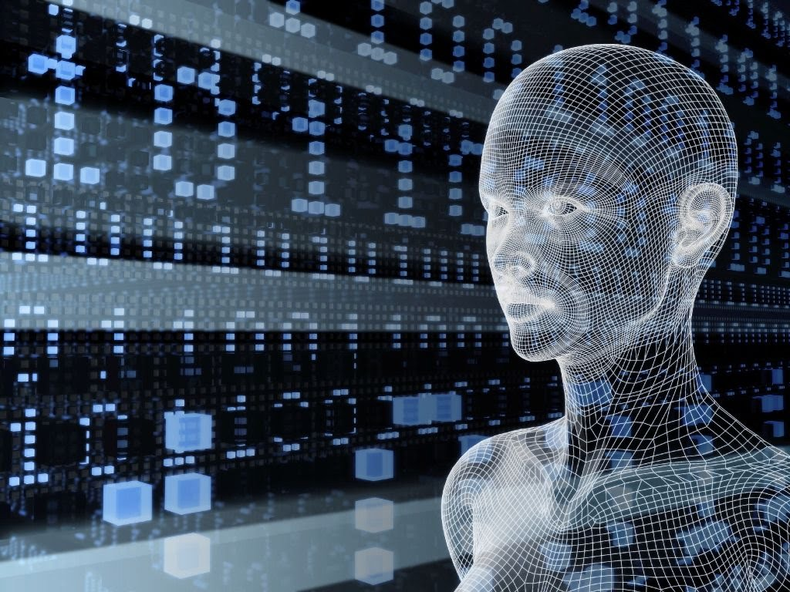

# Вдогонку за прогрессом

## Прогресс и наше место в нем

90% всей имеющейся мировой информации появились за последние несколько лет. Современный мир очень быстро меняется. Возникают новые сферы человеческой деятельности, о которых никто не думал 50, 20 или даже 5 лет назад. И этот темп нарастает всё стремительнее — по параболе. Что, в свою очередь, ускоряет процессы устаревания технологий, а значит и процессы падения квалификации работников самых различных сфер деятельности.

В недалёком будущем 90% всех профессий (как сегодня 90% всей информации) будут новейшими. И речь идёт уже не о столетиях, и даже не о десятках лет, а о годах. Темп нарастает с огромной скоростью.

Подобное положение вещей приводит нас к ситуации, при которой уже не достаточно, как ещё полвека назад, раз в жизни выучится какой-нибудь профессии, а затем всю жизнь работать по специальности и набираться опыта. Да ещё и своим детям потом передать все навыки вместе с дедушкиной типографской машиной, которая ещё ого-го и сто лет проработает. Мы с вами стали очевидцами небывалого ранее в истории технологического перехода, когда одна профессия в своей неизменной (или малоизменной) форме перестала быть достоянием нескольких поколений. Более того, теперь и в будущем она (профессия) перестала быть достоянием даже одного поколения. И чтобы впредь не оказаться выброшенным на обочину новыми технологическими укладами, человеку придётся учиться всю свою жизнь. Сегодня те, кому около сорока, должны снова пройти обучение, чтобы остаться на плаву. Обучиться одной из новых специальностей, которых не было ещё 20 лет назад, либо своей же специальности, но в её новой технологической трактовке. Но те, кто сегодня освоят новую профессию, через 20 лет с полученным набором знаний и навыков уже будут профнепригодны. Простым набором опыта это отставание уже не удастся компенсировать. И к шестидесяти годам им придётся учиться снова.

## Прогресс и наша память

Чем быстрее происходят изменения в окружающей среде, тем быстрее необходимо забывать старые факты. Здоровая реакция мозга на перегруженность информацией - это короткая память. Старые и бесполезные факты специально стираются, чтобы дать место новым и нужным. Память хранит не самую точную информацию, а самую полезную, которая поможет в будущем принимать правильные решения.

Задача памяти - сделать из нас умного человека, который может принимать адекватные решения, чего сложно добиться, если не уметь забывать бесполезную информацию.

## Прогресс и необходимость быть здоровым

Для поддержания здоровья в нашем быстро меняющемся мире не так уж много надо, а именно:

- питаться здоровой пищей, разнообразно, но потреблять в меру, вставая из-за стола с чувством легкого голода.
  Здоровая пища как минимум предполагает ограничение потребления простых углеводов (сахара, мёда, сладких газированных напитков, пирожных, конфет и т.п.) и избегания [промышленных и искуственных трансжиров](https://ecoidea.by/en/node/3591) в продуктах питания.
  Разнообразие предполагает питание, обеспечивающее рост, нормальное развитие и жизнедеятельность человека, с достаточным потреблением всех необходимых [макро- и микронутриентов](https://sayyes.com.ua/mikro-i-makronutrienty-osnovnye-otlichiya-i-pravila-ispolzovaniya/) в зависимости от возраста.

- пить достаточно воды, лучше простой, но качественной
- высыпаться
- заниматься спортом или достаточными физическими нагрузками, в том числе много ходить пешком
- закаляться, принимать контрастный душ
- не курить
- не злоупотреблять алкоголем
- заниматься интересным делом
- окружать себя оптимистичными людьми, самим им быть и чаще смеяться
