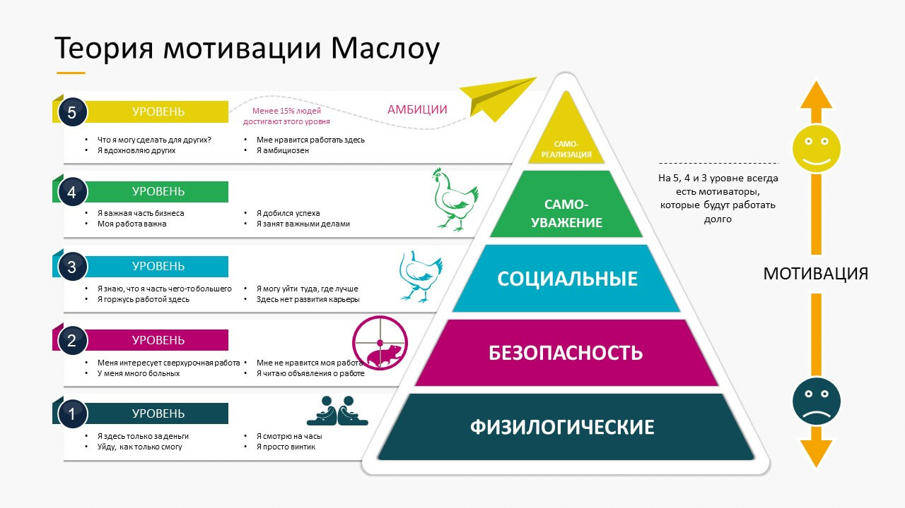

# Иерархия потребностей

Психолог Абрахам Маслоу создал свою концепцию «Иерархии потребностей» в 1943 году. Он описал ее как «Теорию человеческой мотивации», предполагая, что люди мотивированы удовлетворять свои основные потребности, прежде чем переходить к другим, более продвинутым потребностям.

[Теория мотивации Маслоу ](https://trainingtechnology.ru/teoriya-motivacii-maslou-2/)

## Как пандемия повлияла на наш взгляд на иерархию потребностей Маслоу?

> Источник: [Изменила ли пандемия наш взгляд на иерархию потребностей Маслоу? - Дебби Гринвуд](https://www.linkedin.com/pulse/has-pandemic-changed-our-view-maslows-hierarchy-needs-greenwood)

Когда была официально введена изоляция, наша жизнь изменилась в мгновение ока. Практически все в нашей повседневной жизни было другим. Нам пришлось приспосабливаться к тому, чтобы оставаться дома, не имея возможности лично видеться с друзьями или семьей. Никто не был к этому готов, и всем нам пришлось кардинально изменить свою жизнь. Можно с уверенностью сказать, что это изменило наш взгляд на иерархию потребностей Маслоу.

Изоляция и пандемия дали нам возможность оценить, где мы находимся в жизни и где мы хотели бы быть в будущем. Мы думаем о том, как мы хотим что-то изменить. Многим людям приходилось работать дома, и было высказано предположение, что это изменение повлияет на рабочую отрасль в долгосрочной перспективе, продвигая гибкие варианты работы для миллионов людей. Это потенциально может привести к более сильному балансу между работой и личной жизнью.

Это также было полезным временем для того, чтобы поразмышлять о наших приоритетах и ​​ценностях. Люди переосмысливают свой образ жизни и то, подходит ли им их работа. Время пандемии также дало нам возможность понять хрупкость и краткость жизни и заставили многих из нас осознать важность полноценной жизни и, прежде всего, когда это возможно, быть счастливыми на вершине пирамиды.
