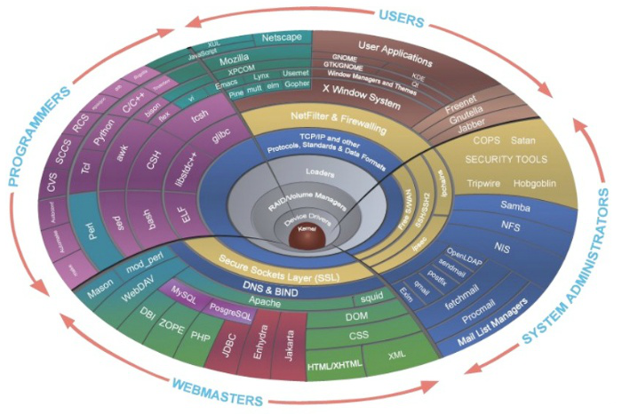
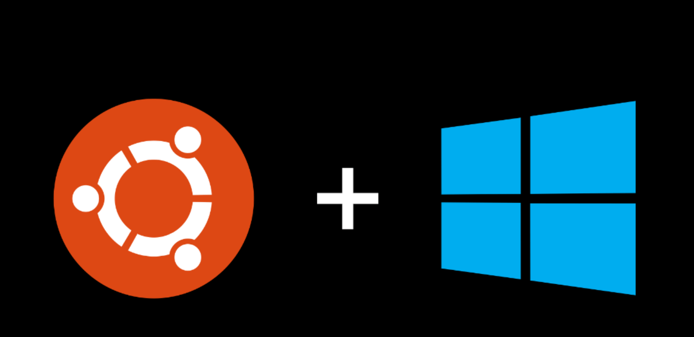
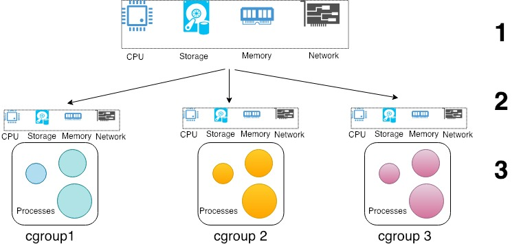

# Linux

## Общие сведения

Linux — семейство Unix-подобных операционных систем на базе ядра Linux, включающих тот или иной набор утилит и программ проекта GNU, и, возможно, другие компоненты. Как и ядро Linux, системы на его основе, как правило, создаются и распространяются в соответствии с моделью разработки свободного и открытого программного обеспечения. Linux-системы распространяются в основном бесплатно в виде различных дистрибутивов — в форме, готовой для установки и удобной для сопровождения и обновлений, — и имеющих свой набор системных и прикладных компонентов, как свободных, так и проприетарных (собственнических).

- [Уроки по Linux](https://ravesli.com/uroki-po-linux/)

## Ядро Linux

Ядро Linux (Linux Kernel ) – это основной компонент операционной системы, являющийся центром этой системы, вокруг которого все и строится. Ядро Linux координирует все действия между аппаратной частью компьютера и всеми компонентами операционной системы, включая приложения. Таким образом, ядро Linux – это та база, та основа, на которой и построена операционная система Linux.

Ядро операционной системы отвечает за её базовые команды и операции, которые она умеет делать:

- управление памятью — выделить место программе, ограничить, очистить;
- управление процессами — запустить, дать ресурсы, убить;
- управление железом — в ядро встроены драйверы для некоторого набора оборудования, чтобы - операционка сразу работала на железе;
- обмен информацией между процессами, службами и программами — чтобы программы могли отправлять запросы в интернет, писать данные на диск, читать с диска, запускать друг друга, обращаться к системе и т.д.

- [Ядро Linux. Версии ядра Linux](https://ravesli.com/linux-kernel/)
- [Ядро Linux 5.14 выпущено сразу после 30-летия Linux](https://linuxthebest.net/yadro-linux-5-14-vipushheno-odrazu-pislya-30-richchya-linux/)



## Дистрибутивы Linux

Дистрибутив Linux — это логически связанная коллекция свободного программного обеспечения на базе ядра Linux под конкретные задачи.

Дистрибутивы различаются как по назначению (для компьютеров, для серверов, для встраиваемых устройств и т. д.), так и по компонентам - у многих дистрибутивов свой собственный набор приложений и утилит.

- [Что такое Linux и что такое дистрибутив Linux?](https://info-comp.ru/drugieopersistemi/686-what-is-linux.html)
- [Многообразие Linux-дистрибутивов](https://habr.com/ru/company/lanit/blog/562484/)
- [10 самых стабильных дистрибутивов Linux в 2021 году](https://analyticsindiamag.com/10-most-stable-linux-distros-in-2021/)
- [Какой Linux выбрать в 2021? Плюсы и минусы разных дистрибутивов](https://pc.ru/articles/best-linux-distros)


## Ubuntu

[Ubuntu](https://ubuntu.com/) подходит для разработчиков, профессионалов и студентов.

[Ubuntu for desktops](https://ubuntu.com/desktop) - настольная операционная система Ubuntu с открытым исходным кодом используется на миллионах ПК и ноутбуков по всему миру. Независимо от того, являетесь ли вы разработчиком мобильных приложений, техническим менеджером, редактором музыки или видео или финансовым аналитиком с крупномасштабными моделями для запуска - фактически, любому, кому нужна мощная машина для вашей работы - Ubuntu - идеальная платформа.

[Ubuntu на WSL](https://ubuntu.com/wsl) - полная терминальная среда Ubuntu за считанные минуты в Windows 10+ с подсистемой Windows для Linux (WSL). Доступ к терминалу Linux в Windows, разработка кроссплатформенных приложений и управление ИТ-инфраструктурой, не выходя из Windows.



## Репозитории Ubuntu

Программы и обновления в Ubuntu устанавливаются преимущественно из репозиториев.

Репозитории – это специальные сервера-хранилища таких файлов. Их также можно назвать «Источниками приложений». Пользовательские компьютеры подключаются к репозиториям по сети или через интернет и при помощи специальных утилит (таких как Synaptic) позволяют Вам увидеть, какие пакеты у Вас установлены, какие доступны для установки. Большинство утилит поддерживают простой поиск по ключевым словам и способны разбивать группы пакетов по категориям.

В Ubuntu всё программное обеспечение делится на четыре секции, называемые компонентами, чтобы отразить разницу в лицензии и уровне доступной поддержки.

Пакеты распределяются по компонентам таким образом:

- **Main** – свободное ПО, официально поддерживаемое компанией Canonical.
- **Restricted** – проприетарное ПО (в основном — драйверы устройств), официально поддерживаемое компанией Canonical.
- **Universe** – свободное ПО, официально не поддерживаемое компанией Canonical (но поддерживаемое сообществом пользователей).
- **Multiverse** – проприетарное ПО, не поддерживаемое компанией Canonical.

Существует четыре основных репозитория Ubuntu.

- **$release** – это пакеты на момент выхода релиза.
- **$release-security** – пакеты критических обновлений безопасности.
- **$release-updates** – пакеты обновления системы (т.е. более поздние версии ПО, вышедшие уже - после релиза).
- **$release-backports** – бэкпорты более новых версий некоторого ПО, которое доступно только в нестабильных версиях Ubuntu.
- **partner** – репозиторий содержищий ПО компаний-партнеров Canonical.

Кроме официальных, существует множество репозиториев от авторов программ и от тех, кто не поленился собрать из исходников пакет и поделиться им с другими. Launchpad предлагает создавать PPA-репозитории — [Personal Package Archive](https://help.ubuntu.ru/wiki/ppa), обычно небольшой репозиторий, в который его хозяин складывает исходники, а пользователи на выходе получают уже готовый deb-пакет.

Системный список репозиториев содержится в файле /etc/apt/sources.list. Для того, чтобы добавить репозиторий - отредактируйте этот файл, например так:

```bash
sudo nano /etc/apt/sources.list
```

- [Репозитории - help.ubuntu.ru](https://help.ubuntu.ru/wiki/репозиторий)

## Linux groups

cgroups (сокращенно от control groups, группы управления) - это функция ядра Linux, которая ограничивает, учитывает и изолирует использование ресурсов (ЦП, память, дисковый ввод-вывод, сеть и т. д.) коллекцией процессов.


