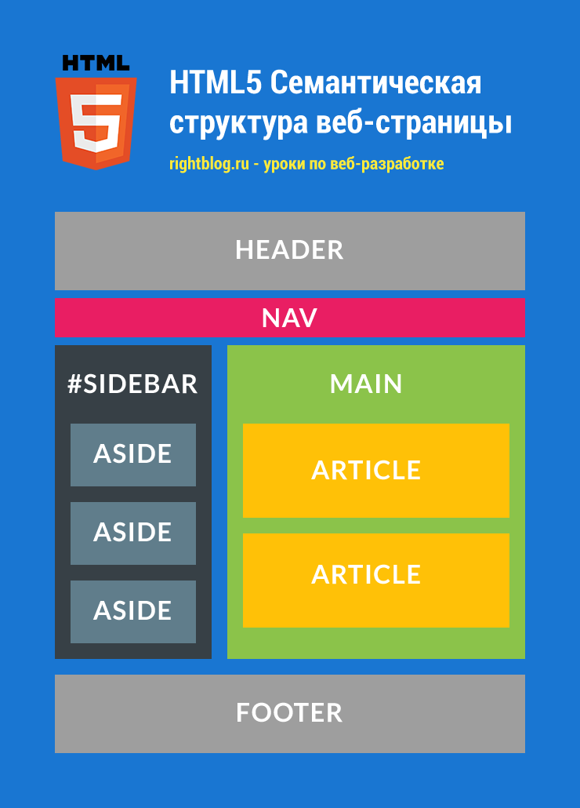

# HTML

HTML5 — открытая платформа, предназначенная для создания веб-приложений использующих аудио, видео, графику, анимацию и многое другое.

HTML 5 применяется преимущественно в двух значениях:

- HTML 5 как обновленный язык разметки гипертекста, некоторое развитие предыдущей версии HTML 4

- HTML 5 как мощная платформа для создания веб-приложений, которая включает не только непосредственно язык разметки гипертекста, обновленный HTML, но и язык программирования JavaScript и каскадные таблицы стилей CSS 3.

Руководства

- [HTML5 - htmlbook.ru](http://htmlbook.ru/html5)
- [Руководство по HTML5 и CSS3 - metanit.com](https://metanit.com/web/html5/)
- [HTML - developer.mozilla.org](https://developer.mozilla.org/ru/docs/Web/HTML)
- [HTML для Начинающих - Практический Курс [2021]. Видео](https://www.youtube.com/watch?v=DOEtVdkKwcU)

